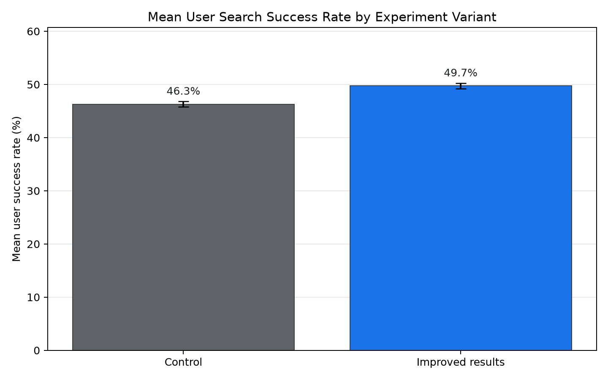
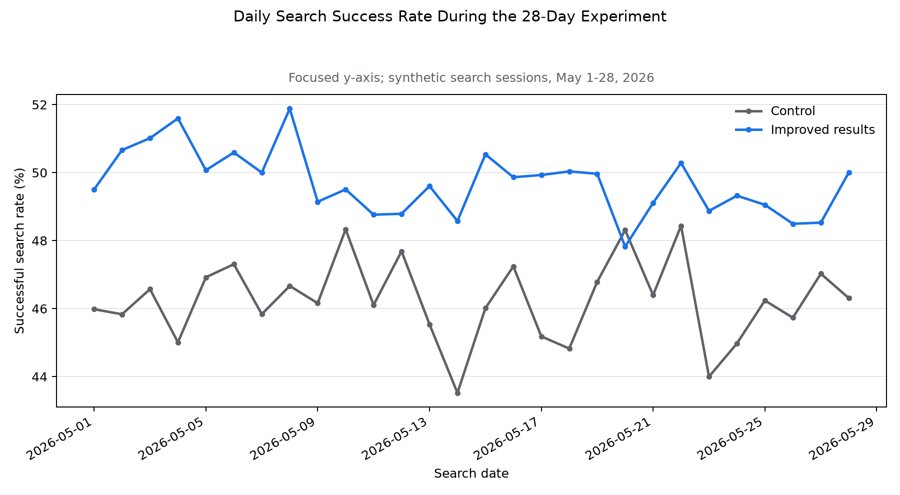

# Search Feature Experiment and User Engagement Analysis

## Overview

This repository evaluates a randomized experiment for an improved search-results experience. The analysis measures whether the treatment increased successful searches while maintaining acceptable product reliability.

The dataset is synthetic. It does not contain information from Google, YouTube, or any other company, and the findings do not represent the performance of a real search product.

## Experiment question

Does an improved search-results experience increase meaningful engagement without causing an unacceptable increase in search errors?

## Experiment design

| Component | Definition |
|---|---|
| Population | 12,000 synthetic users with at least one search session |
| Experiment period | May 1–28, 2026 |
| Randomization unit | User |
| Control | Existing search-results experience |
| Treatment | Improved search-results experience |
| Primary metric | Mean user search success rate |
| Guardrail | Mean user search error rate |

A successful search is a session with a result click followed by at least two minutes of watch time. Metrics are first aggregated to the user level because users can contribute multiple sessions and the user is the randomization unit.

The synthetic decision rule requires:

- A 95% confidence interval for primary-metric lift entirely above zero
- An upper 95% confidence bound below a 0.5 percentage-point increase in search errors
- No evidence of assignment imbalance at `p < 0.01`

## Data

| Table | Grain | Records | Selected fields |
|---|---|---:|---|
| `experiment_assignments` | One row per user | 12,000 | Variant, platform, region, tenure |
| `search_sessions` | One row per search session | 81,816 | Query category, clicks, search success, watch time, errors |

The data generator uses a fixed random seed so the complete experiment can be reproduced.

## Methods

- **SQL / SQLite:** experiment scorecards, user-level aggregation, daily stability, and segment analysis
- **Python / pandas:** synthetic data generation, quality validation, metric calculation, confidence intervals, and charts
- **R:** assignment-balance testing, a user-level Welch t-test, guardrail testing, and visualization

## Results

- The improved-results variant increased mean user search success from **46.30% to 49.74%**, an absolute lift of **3.44 percentage points**.
- The approximate 95% confidence interval for the lift was **2.70 to 4.19 percentage points** (`p < 0.001`).
- Session click-through rate increased from **54.29% to 57.58%**, while the zero-result rate decreased from **7.36% to 6.27%**.
- Average watch time after a search increased from **3.72 to 4.08 minutes per session**.
- Mean user search error rate increased from **0.98% to 1.14%**, a difference of **0.16 percentage points** with an approximate 95% interval of **0.00 to 0.32 points**.
- The sample-ratio check found no assignment imbalance (`p = 0.401`).

The generated result meets the stated decision rule, but the small increase in the error-rate guardrail should be investigated and monitored during any staged rollout. Platform results are exploratory and should not be treated as independently confirmed treatment effects.





## Repository contents

```text
search-feature-experiment-analysis/
|-- analysis/
|   `-- search_experiment_analysis.Rmd
|-- data/
|   |-- raw/
|   `-- processed/
|-- reports/
|   `-- experiment_readout.md
|-- sql/
|   |-- 01_schema.sql
|   `-- 02_experiment_analysis.sql
|-- src/
|   |-- generate_data.py
|   `-- analyze.py
|-- tests/
|   `-- test_data_quality.py
|-- tools/
|   `-- validate_project.py
|-- LICENSE
`-- requirements.txt
```

## Reproducing the analysis

Python 3.10 or later is recommended.

```bash
python -m venv .venv
```

Activate the environment on Windows:

```powershell
.venv\Scripts\Activate.ps1
```

On macOS or Linux:

```bash
source .venv/bin/activate
```

Install the packages and run the workflow:

```bash
pip install -r requirements.txt
python src/generate_data.py
python src/analyze.py
pytest
python tools/validate_project.py
```

To run the statistical analysis, open `analysis/search_experiment_analysis.Rmd` in RStudio and select **Knit**. The file produces GitHub-flavored Markdown and requires `dplyr`, `ggplot2`, `knitr`, and `scales`.

## Limitations

The experiment and its treatment effect are synthetic. The analysis does not estimate the impact of an actual product change, and the decision thresholds are illustrative rather than company policy. The normal-approximation checks in Python should be compared with the Welch t-tests in the R Markdown output after it is run. Segment findings are exploratory, and real experiments would also require instrumentation review, exposure logging, novelty checks, and longer-term outcome monitoring.

## License

This project is available under the MIT License.
